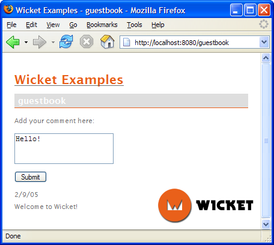

The GuestBook application allows users to enter comments that appear on a
page like a weblog. Drawing the list of comments is very easy with the Wicket
`ListView` component. This example also gives an impression of what form
handling is like.

As with all examples, you have to put all files in the same package
directory. This means putting the markup files and the java files next to one
another. It is possible to alter this behavior, but that is beyond the scope
of this example.

## Comment.java ##

The Comment POJO model is very straightforward:


package org.apache.wicket.examples.guestbook;

import java.util.Date;  
import org.apache.wicket.IClusterable;

public class Comment implements IClusterable {
    private String text;
    private Date date = new Date();

    public Comment() {
    }

    public Comment(final Comment comment) {
        this.text = comment.text;
        this.date = comment.date;
    }

    public String getText() {
        return text;
    }

    public void setText(String text) {
        this.text = text;
    }

    public Date getDate() {
        return date;
    }

    public void setDate(Date date) {
        this.date = date;
    }

    public String toString() {
        return "[Comment date = " + date + ", text = " + text + "]";
    }
}


## GuestBook.java ##

In the file `GuestBook.java` we have put the Java component code for the
guestbook page. This is the homepage for the guestbook application. The page
consists of a form for entering new items to the guestbook and a list of
repeating markup for showing the guestbook entries.

The `GuestBook` constructor adds a `CommentForm` and a `ListView` of
the comments. Notice how the model is passed in as the second argument to the
`ListView` constructor.

Then as the view renders, the `populateItem` method is called passing in a
`ListItem` container for the current row in the list.

The implementation below obtains the `Comment` POJO from the list item and
adds label components for the date and text of the `Comment`. This is all
accomplished in just a few lines of code.


package org.apache.wicket.examples.guestbook;

import java.util.ArrayList;
import java.util.Collections;
import java.util.Date;
import java.util.List;

import org.apache.commons.lang.StringUtils;
import org.apache.wicket.examples.WicketExamplePage;
import org.apache.wicket.markup.html.basic.Label;
import org.apache.wicket.markup.html.basic.MultiLineLabel;
import org.apache.wicket.markup.html.form.Form;
import org.apache.wicket.markup.html.form.TextArea;
import org.apache.wicket.markup.html.form.TextField;
import org.apache.wicket.markup.html.list.ListItem;
import org.apache.wicket.markup.html.list.PropertyListView;
import org.apache.wicket.model.CompoundPropertyModel;
import org.apache.wicket.util.value.ValueMap;

public final class GuestBook extends WicketExamplePage {
    /** A global list of all comments from all users across all sessions */
    private static final List<Comment> commentList = Collections.synchronizedList(new ArrayList<Comment>());

    /**
     * Constructor that is invoked when page is invoked without a session.
     */
    public GuestBook() {
        // Add comment form
        add(new CommentForm("commentForm"));

        // Add commentListView of existing comments
        add(new PropertyListView<Comment>("comments", commentList) {
            @Override
            public void populateItem(final ListItem<Comment> listItem) {
                listItem.add(new Label("date"));
                listItem.add(new MultiLineLabel("text"));
            }
        }).setVersioned(false);
    }

    /**
     * A form that allows a user to add a comment.
     */
    public final class CommentForm extends Form<ValueMap> {
        public CommentForm(final String id) {
            // Construct form with no validation listener
            super(id, new CompoundPropertyModel<ValueMap>(new ValueMap()));

            // this is just to make the unit test happy
            setMarkupId("commentForm");

            // Add text entry widget
            add(new TextArea<String>("text").setType(String.class));

            // Add simple automated spam prevention measure.
            add(new TextField<String>("comment").setType(String.class));
        }

        /**
         * Show the resulting valid edit
         */
        @Override
        public final void onSubmit() {
            ValueMap values = getModelObject();

            // check if the honey pot is filled
            if (StringUtils.isNotBlank((String)values.get("comment"))) {
                error("Caught a spammer!!!");
                return;
            }
            // Construct a copy of the edited comment
            Comment comment = new Comment();

            // Set date of comment to add
            comment.setDate(new Date());
            comment.setText((String)values.get("text"));
            commentList.add(0, comment);

            // Clear out the text component
            values.put("text", "");
        }
    }

    /**
     * Clears the comments.
     */
    public static void clear() {
        commentList.clear();
    }
}


When the `CommentForm` is submitted, the `onSubmit()` method is called.
Notice that nothing gets the value of the `TextArea` that was added in the
`CommentForm` constructor. This is because the comment is the model and the
third parameter to the `TextArea` constructor specified the property of the
model to update. So all `onSubmit()` has to do is create a new comment from
the model that was updated and add it to the comment list. When the page
redraws, the new list will be rendered.

We use a synchronized list as our shared static model used by `commentListView`
(`commentList`) to ensure that it is only updated by one thread at a time.
Remember, this is a multi-user application with a shared model!

Finally, you may notice the call to `commentListView.modelChanged()`. This
informs the list view that its model has been modified. In more advanced
usage scenarios, this would allow Wicket to expire stale pages accessed with
the browser's back button.

## GuestBook.html ##

In the HTML below, notice the way that the `TextArea` component is being
nested inside the `CommentForm`. Wicket is able to keep everything straight
because the Java `Component.add()` calls have to result in the same nesting
structure as the HTML.

Finally, notice the `<wicket:remove>` block. This is simply markup that is
there for previewing purposes only. When the page renders, it is stripped
out.


<html xmlns:wicket="http://wicket.apache.org/">
<head>
    <title>Wicket Examples - guestbook</title>
    <link rel="stylesheet" type="text/css" href="style.css"/>
</head>
<body>
  

  <form wicket:id="commentForm">
    Add your comment here:
    

    <textarea wicket:id="text">This is a comment</textarea>
    <input type="text" wicket:id="comment" class="nospam" onfocus="getElementById('formsubmit').focus();"/>
    

    <input type="submit" value="Submit" id="formsubmit"/>
  </form>
  

  
    

        1/1/2004 
        Comment text goes here.
    

  
  <wicket:remove>
    

        1/2/2004 
        More comment text here.
    

  </wicket:remove>
</body>
</html>


## GuestBookApplication.java ##

For completeness, we've included the `GuestBookApplication` class, and as a
final treat the modifications to the `web.xml` file.


package org.apache.wicket.examples.guestbook;

import org.apache.wicket.Page;
import org.apache.wicket.examples.WicketExampleApplication;

public class GuestBookApplication extends WicketExampleApplication {
    public GuestBookApplication() {
    }

    @Override
    public Class< ? extends Page> getHomePage() {
        return GuestBook.class;
    }
}


## web.xml ##

Add the following two sections (servlet and servlet-mapping) to your web.xml
file for running this application.


<filter>
    <filter-name>GuestBookApplication</filter-name>
    <filter-class>org.apache.wicket.protocol.http.WicketFilter</filter-class>
    <init-param>
      <param-name>applicationClassName</param-name>
      <param-value>org.apache.wicket.examples.guestbook.GuestBookApplication</param-value>
    </init-param>
</filter>

